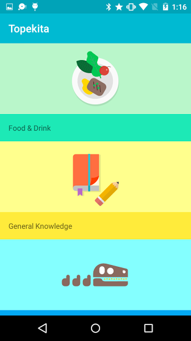

# Dagger2-MVP-Sample

Simple List example to show how Dagger2 works.

Inspired in googlesamples / [android-topeka](https://github.com/googlesamples/android-topeka)

## Screenshot

## Do you want to learn Dagger2??  

MarioKart Kata for Android Developers The main goal is to practice Dependency injection using Dagger 2. 

* [Source Code - MarioKart Kata Dagger 2](https://github.com/erikcaffrey/Kata-Dagger2-MarioKart)
* [BlogPost - MarioKart Kata Dagger 2](https://erikcaffrey.github.io/ANDROID-kata-dagger2/) (spanish)

Developed By
------------

* Erik González  - <erikcaffrey10@gmail.com>

Do you want to contribute?
--------------------------

Feel free to report or add any useful feature, I will be glad to improve it with your help, before submitting your code please check the [codestyle](https://github.com/square/java-code-styles).

License
-------

    Copyright 2016 Erik Jhordan Rey

    Licensed under the Apache License, Version 2.0 (the "License");
    you may not use this file except in compliance with the License.
    You may obtain a copy of the License at

       http://www.apache.org/licenses/LICENSE-2.0

    Unless required by applicable law or agreed to in writing, software
    distributed under the License is distributed on an "AS IS" BASIS,
    WITHOUT WARRANTIES OR CONDITIONS OF ANY KIND, either express or implied.
    See the License for the specific language governing permissions and
    limitations under the License.

